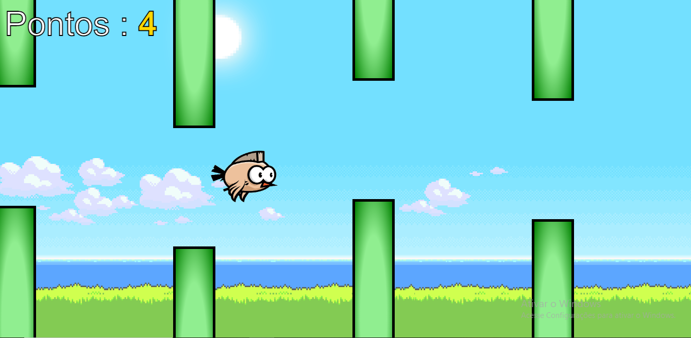

# Flappy Bird 🐦

Um jogo simples e divertido inspirado no famoso Flappy Bird, desenvolvido com JavaScript, HTML5 e CSS3.

## 🎮 Sobre o jogo

O **Flappy Bird** é um jogo onde o objetivo é manter o pássaro voando, desviando de obstáculos para ganhar pontos. Com controles simples e uma jogabilidade viciante, ele testa suas habilidades e reflexos.


## 🚀 Funcionalidades

- Controle do pássaro com apenas um clique.
- Obstáculos gerados dinamicamente.
- Sistema de pontuação.
- Reinício fácil após o fim de jogo.

## 🛠️ Tecnologias utilizadas

- **HTML5**: Estrutura do jogo.
- **CSS3**: Estilização e design.
- **JavaScript**: Lógica de jogo e interatividade.

## 📂 Estrutura do projeto

flappyBird/ ├── index.html # Arquivo principal ├── styles.css # Estilos do jogo ├── script.js # Lógica do jogo ├── assets/ # Imagens e sons do jogo └── README.md # Documentação


## 🖥️ Pré-requisitos

- Um navegador moderno que suporte JavaScript.

## 📦 Como executar o jogo

1. Clone o repositório:
   ```bash
   git clone https://github.com/JoaoGomesDev32/flappyBird.git

bash
Copiar código


## 🖥️ Pré-requisitos

- Um navegador moderno que suporte JavaScript.

## 📦 Como executar o jogo

1. Clone o repositório:
   ```bash
   git clone https://github.com/JoaoGomesDev32/flappyBird.git


# flappyBird com Javascript

Jogue através do link: https://voapassarinhovoa.netlify.app/


## ✨ Descrição

#### <p align="justify">Jogo Flappy Bird baseado no canal @codeCreative do youtube desenvolvido com javascript.</p>

## ✨ Tecnologias usadas
<div style="display: inline_block">
  
  
  
</div>
